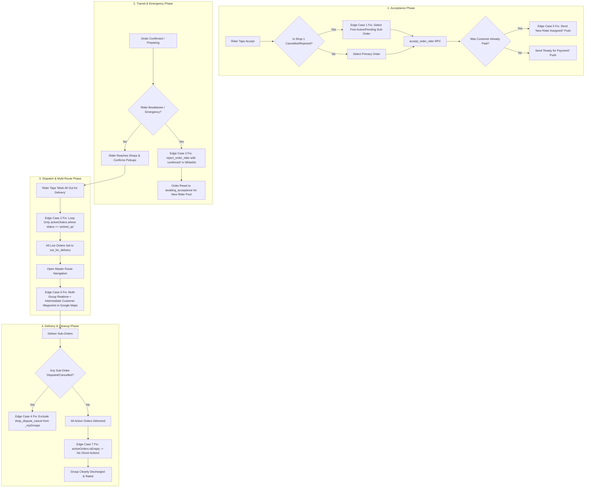

# 100x Forensic Edge-Case Audit & Remediation Plan: Rider Multi-Shop & Cross-Customer Lifecycle

## Executive Summary

Following the successful implementation and verification of the initial 6 components (58/58 tests passing), a line-by-line 100x forensic audit was conducted across the entire order lifecycle—inspecting Flutter state handlers, PostGIS/PostgreSQL RPCs, Realtime channels, push notification pipelines, and drop/reassign state machines.

This deep dive uncovered **7 critical edge cases** that could lead to rider lockouts, navigation errors, duplicate payment prompts to customers, or state machine crashes in production.

> [!IMPORTANT]
> **Strict Non-Destructive / Additive Policy**:
> All backend fixes will reside in a new additive migration (`supabase/migrations/20290000000130_100x_rider_confirmed_drop_and_query_fortress.sql`).
> No existing tables or schemas will be altered.
> Soft deletes rule (`.eq('is_deleted', false)` on `products`) and immediate test cleanup will be strictly enforced.

---

## 1. Forensic Audit Matrix: 7 Uncovered Edge Cases

| # | Edge Case Category | File & Location | Root Cause | Real-World Impact | Remediation |
|---|--------------------|-----------------|------------|-------------------|-------------|
| **1** | **Dead Sub-Order Acceptance Blocker** | [`lib/pages/delivery/dashboard_page.dart:763`](file:///Users/muhtaashimnazki/Downloads/Enything/lib/pages/delivery/dashboard_page.dart#L763) | `_acceptOrderGroup` passes `group.orders.first` to `_acceptOrder`. If Shop 1 rejected (`seller_rejected`) or cancelled before acceptance, `group.orders.first` is dead. | Fast-fail check (`currentStatus != 'awaiting_acceptance' && currentStatus != 'pending'`) aborts with `"⚠️ Order no longer available"`. Rider is blocked from accepting the remaining live shop in the group! | Pass `group.activeOrders.firstWhere((o) => o.status == 'awaiting_acceptance' || o.status == 'pending', orElse: () => group.activeOrders.first)`. |
| **2** | **"Mark All Out for Delivery" State Machine Crash** | [`lib/pages/delivery/dashboard_page.dart:2914`](file:///Users/muhtaashimnazki/Downloads/Enything/lib/pages/delivery/dashboard_page.dart#L2914) | Button loops over `group.orders` instead of `group.activeOrders`, and doesn't verify `o.status == 'picked_up'`. | If Shop 1 was picked up but Shop 2 was cancelled/disputed, `update_order_status` throws `Cannot mark out_for_delivery from cancelled` (or `shop_dispute_cancel`). Dispatch action fails and shows error snackbar. | Filter loop strictly to `group.activeOrders.where((o) => o.status == 'picked_up').toList()`. |
| **3** | **Rider Drop Lockout on `'confirmed'` Status** | [`supabase/migrations/20260866000000_100x_rider_drop_fortress.sql:53,71`](file:///Users/muhtaashimnazki/Downloads/Enything/supabase/migrations/20260866000000_100x_rider_drop_fortress.sql#L53-L71) | Whitelist in `reject_order_rider` omits `'confirmed'` (the status right after customer pays, before shop taps 'preparing'). | If a rider has an emergency/breakdown right after payment captures, dropping the order throws `CRITICAL: Cannot drop... (Status: confirmed)`. Rider is trapped and order cannot be reallocated! | Add `'confirmed'` to the permitted drop statuses in `reject_order_rider` via Migration 130. |
| **4** | **Ghost / Zombie Disputed Groups in Active Deliveries** | [`lib/pages/delivery/dashboard_page.dart:588-591, 715`](file:///Users/muhtaashimnazki/Downloads/Enything/lib/pages/delivery/dashboard_page.dart#L588-L591) | `_loadOrders()` `.neq` query only excludes `delivered, cancelled, seller_rejected, partner_rejected`. It omits `shop_dispute_cancel, timeout, failed, returned, refunded`. | A rider who reports a shop dispute (`shop_dispute_cancel`) still receives that order in `myOrders`. `_myGroups` creates a zombie card with `activeOrders = []`, wasting an active delivery slot. | Exclude all terminal statuses in `_loadOrders()` and filter `_myGroups = _groupOrders(myRawOrders).where((g) => g.activeOrders.isNotEmpty).toList()`. |
| **5** | **Erroneous "Ready for Payment!" Push on Reassigned Paid Orders** | [`lib/pages/delivery/dashboard_page.dart:916, 962-970`](file:///Users/muhtaashimnazki/Downloads/Enything/lib/pages/delivery/dashboard_page.dart#L916-L970) | `_acceptOrder` fast-fail query only selects `status`, omitting `payment_status`. When a dropped order is re-accepted by a new rider, its pre-acceptance status was `'awaiting_acceptance'`. | The customer already paid (`payment_status == 'captured'`), but receives a push: `"Ready for Payment! Complete payment within 10 minutes"`, causing panic and confusion. | Select `status, payment_status` in `_acceptOrder`. If `payment_status == 'captured'`, suppress payment push and send `"New Rider Assigned! 🛵"`. |
| **6** | **Master Route Multi-Customer Navigation Incompleteness** | [`lib/pages/delivery/order_route_map_page.dart:127, 250, 365, 375`](file:///Users/muhtaashimnazki/Downloads/Enything/lib/pages/delivery/order_route_map_page.dart#L127) | 1. Realtime subscription only listens to `widget.group` (Group 1).<br>2. `unpickedShops` only checks `!= 'picked_up' && != 'out_for_delivery'` (includes `delivered`).<br>3. `_openInExternalMap` hardcodes `widget.group.deliveryLat` as destination. | In multi-customer runs: Groups 2 & 3 get no realtime updates; delivered shops are re-routed as unpicked stops; Google Maps navigates only to Customer 1, leaving Customers 2 & 3 out of the route! | 1. Subscribe to all cart groups in `widget.groups`.<br>2. Whitelist unpicked shops (`confirmed, preparing, ready_for_pickup`).<br>3. Chain intermediate drop-offs into `waypoints` and set last customer as destination. |
| **7** | **`OrderGroup` Fallback Leak on Fully Terminal Groups** | [`lib/models/order_group.dart:64, 69, 78`](file:///Users/muhtaashimnazki/Downloads/Enything/lib/models/order_group.dart#L64-L78) | `allArrived`, `allPickedUp`, and `allOutForDelivery` fall back to `orders` when `activeOrders.isEmpty`. | If all sub-orders in a cart group are cancelled or disputed, checking these getters against dead orders can evaluate to true or trigger incorrect UI states. | When `activeOrders.isEmpty`, strictly return `false` for `allArrived`, `allPickedUp`, and `allOutForDelivery`. |

---

## 2. Technical Architecture & State Machine Flow



---

## 3. Step-by-Step Remediation Plan

### Step 1: Core Model Fallback Hardening
**File**: [`lib/models/order_group.dart`](file:///Users/muhtaashimnazki/Downloads/Enything/lib/models/order_group.dart)
- In `allArrived`, `allPickedUp`, and `allOutForDelivery`:
  Ensure that if `activeOrders.isEmpty`, the getters immediately return `false`.
  No fallback to `orders` when all orders are terminal.

### Step 2: Rider Dashboard Acceptance, Dispatch & Zombie Query Fortification
**File**: [`lib/pages/delivery/dashboard_page.dart`](file:///Users/muhtaashimnazki/Downloads/Enything/lib/pages/delivery/dashboard_page.dart)
1. **Edge Case 1**: In `_acceptOrderGroup`, resolve the target order:
   ```dart
   final targetOrder = group.activeOrders.firstWhere(
     (o) => o.status == 'awaiting_acceptance' || o.status == 'pending',
     orElse: () => group.activeOrders.isNotEmpty ? group.activeOrders.first : group.orders.first,
   );
   final success = await _acceptOrder(targetOrder, skipReload: true, notifyCustomer: false);
   ```
2. **Edge Case 2**: In `Mark All Out for Delivery` button action:
   ```dart
   final deliverableOrders = group.activeOrders
       .where((o) => o.status == 'picked_up')
       .toList();
   for (int i = 0; i < deliverableOrders.length; i++) {
     await _updateStatus(deliverableOrders[i], 'out_for_delivery',
         skipReload: true, notifyCustomer: i == 0);
   }
   _loadOrders();
   ```
3. **Edge Case 4**: In `_loadOrders()`:
   - Expand `.neq` exclusions or filter query results to exclude `shop_dispute_cancel`, `timeout`, `failed`, `returned`, `refunded`, `verification_failed`, `no_rider`.
   - Filter `_myGroups`:
     ```dart
     _myGroups = _groupOrders(myRawOrders).where((g) => g.activeOrders.isNotEmpty).toList();
     ```
4. **Edge Case 5**: In `_acceptOrder`:
   - Query `select('status, payment_status')` instead of just `'status'`.
   - Check `final isPaid = latest?['payment_status'] == 'captured' || order.paymentStatus == 'captured';`
   - If `notifyCustomer`:
     - If `isPaid`: Send `"New Rider Assigned! 🛵"`.
     - If `!isPaid`: Send `"Ready for Payment! 💳"`.

### Step 3: Backend Drop Order Fortress Fortification
**File**: `supabase/migrations/20290000000130_100x_rider_confirmed_drop_and_query_fortress.sql`
- Re-create `public.reject_order_rider(UUID, TEXT, BOOLEAN)`:
  - Add `'confirmed'` to the status check in line 53:
    ```sql
    IF v_status NOT IN ('awaiting_acceptance', 'pending', 'confirmed', 'preparing', 'ready_for_pickup', 'awaiting_payment') THEN
      RAISE EXCEPTION 'CRITICAL: Cannot drop an order after it has been picked up or delivered (Status: %). Contact platform support.', v_status;
    END IF;
    ```
  - Add `'confirmed'` to the cart group reset `WHERE` clause in line 71:
    ```sql
    AND status IN ('awaiting_acceptance', 'pending', 'confirmed', 'preparing', 'ready_for_pickup', 'awaiting_payment');
    ```

### Step 4: Master Route Multi-Group Realtime & External Map Navigation
**File**: [`lib/pages/delivery/order_route_map_page.dart`](file:///Users/muhtaashimnazki/Downloads/Enything/lib/pages/delivery/order_route_map_page.dart)
1. **Multi-Group Realtime**:
   - Collect all distinct `cartGroupId`s and order `id`s across `widget.groups` (or fallback to `widget.group`).
   - Subscribe a `RealtimeChannel` for each group so updates to any customer's sub-orders reflect immediately.
   - Cleanly remove all channels in `dispose()`.
2. **Proper Unpicked Whitelisting**:
   - In `_fetchRoutes` and `_openInExternalMap`:
     ```dart
     final unpickedShops = shops.where((s) =>
         s.status == 'confirmed' ||
         s.status == 'preparing' ||
         s.status == 'ready_for_pickup'
     ).toList();
     ```
3. **Multi-Customer External Map Route**:
   - In `_openInExternalMap()`:
     - Collect all unpicked shops.
     - If multiple groups are active:
       - Intermediate customer drop-offs are added as waypoints.
       - The final customer drop-off is set as `destination`.
     - Construct full URI with all stops in sequential order.

### Step 5: Customer Map Hardening
**File**: [`lib/pages/customer/customer_order_map_page.dart`](file:///Users/muhtaashimnazki/Downloads/Enything/lib/pages/customer/customer_order_map_page.dart)
- In `_refreshPickupRoute`:
  - Use `OrderGroup.isTerminal(s.status)` or whitelist active statuses (`confirmed, preparing, ready_for_pickup`).
  - Ensure unpicked shops exclude `delivered`.

### Step 6: Automated Test Matrix Expansion
**File**: [`test/test_100x_dashboards_exhaustive_edge_cases.dart`](file:///Users/muhtaashimnazki/Downloads/Enything/test/test_100x_dashboards_exhaustive_edge_cases.dart)
Add tests for each new edge case:
- `R-EC-16`: Dead first sub-order acceptance guard selects surviving live order.
- `R-EC-17`: "Mark All Out for Delivery" only updates orders with status `'picked_up'`.
- `R-EC-18`: Drop order whitelist allows `'confirmed'` status.
- `R-EC-19`: `_myGroups` filters out zombie groups whose orders are all disputed/terminal.
- `R-EC-20`: Re-assigned order push sends "New Rider Assigned" when payment is captured.
- `R-EC-21`: Master route external map chains multiple customer drop-offs into waypoints.
- `R-EC-22`: `OrderGroup` returns false for `allPickedUp` when `activeOrders` is empty.

---

## 4. Verification Plan

### Automated Execution
```bash
flutter test test/test_100x_dashboards_exhaustive_edge_cases.dart
flutter test
flutter analyze lib/models/order_group.dart lib/pages/delivery/ lib/pages/customer/
```

### Success Criteria
- 100% of existing tests (58/58) pass with 0 regressions.
- All 7 newly added tests pass.
- 0 lint or static analysis errors across all modified files.
- Zero test leftover entities in database.
