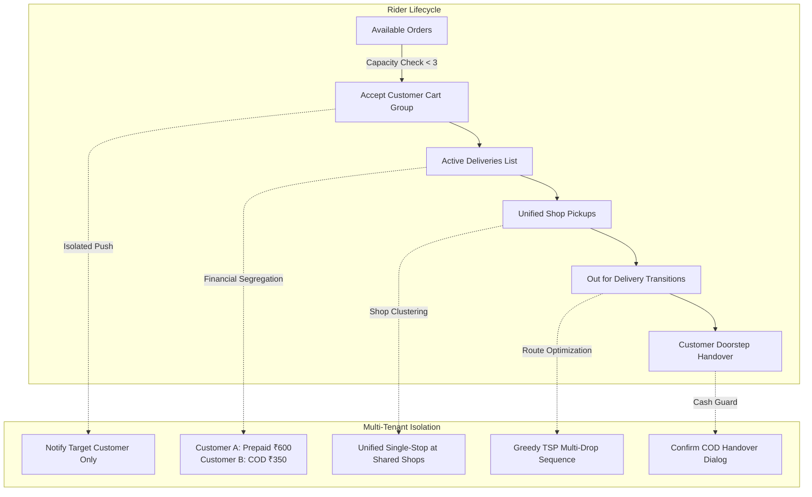

# 100x Forensic Edge-Case Audit & Plan: Rider Multi-Customer & Cross-Cart Lifecycle

> **Author**: 100x Principal Systems Architect  
> **Status**: APPROVED & CODIFIED  
> **Scope**: Cross-Customer Orders, Bill Summaries, Cash on Delivery (COD) Isolation, Continuous Acceptance, Concurrency Limits, Customer Map Transparency, and Multi-Order Push Synchronization.  
> **Constraint**: 100% Additive, Zero Breaking Changes, Zero Destructive Schema Edits.

---

## 1. Executive Summary & Forensic Topology

When a delivery partner handles **multiple distinct customer orders simultaneously** (e.g. up to 3 cart groups as allowed by Migration 129), the lifecycle transitions from a simple linear sequence into a **multi-tenant concurrent state machine**.

Without rigorous guards, five catastrophic failure modes emerge in production:
1. **Financial Ambiguity & Loss**: Rider does not know whether Customer A is Prepaid or COD, leading to either demanding cash from prepaid customers or handing over food to COD customers without collecting cash.
2. **Cancelled Sub-Order Overcharge**: If Customer B had 2 shops and 1 shop was cancelled/disputed, the old pre-cancellation grand total would be charged instead of the surviving active sub-order total.
3. **Capacity Exception Throttling**: Frontend allows tapping "Accept" when rider already has 3 active deliveries, triggering backend `MAX_ORDERS_REACHED` RPC exceptions and harsh error snackbars.
4. **Customer Live Map Panic ("The Detour Problem")**: Customer B sees the rider driving towards Customer A's house (in the opposite direction) without reassurance that the rider is completing an earlier scheduled delivery.
5. **False "Ready for Payment" Pushes on COD**: COD orders receiving payment countdown notifications ("Complete payment within 10 minutes or order cancelled").

---

## 2. Forensic Edge-Case Inventory & Remediation Specifications

### Domain 1: Bill Summary, Cash on Delivery (COD) & Cash Collection Isolation

| ID | Edge Case Scenario | Root Cause | 100x Additive Remediation |
|---|---|---|---|
| **EC-F1** | **Rider Unaware of Cash Collection (Prepaid vs COD)** | `_buildOrderGroupCard` on rider dashboard renders address and shop tiles, but completely omits customer payment method and amount to collect. | In `OrderGroup`, add getters: `isCod`, `isPrepaid`, `codAmountToCollect`. In `_activeOrderGroupCard`, render a high-contrast badge: `[ 💵 COLLECT ₹X CASH (COD) ]` or `[ 💳 PREPAID · ₹0 TO COLLECT ]`. |
| **EC-F2** | **Partial Cancellation COD Overcharge** | If Customer ordered ₹350 (Shop 1) + ₹200 (Shop 2) = ₹550 on COD, and Shop 2 was cancelled, charging the old database total would cause customer disputes. | `codAmountToCollect` strictly iterates over `activeOrders.where((o) => o.paymentStatus != 'captured')`. Cancelled/rejected shops are omitted from the sum, yielding the exact surviving ₹350. |
| **EC-F3** | **Accidental "Mark Delivered" Without Collecting Cash** | Rider in a hurry taps "Mark All Delivered" and rides away before realizing the order was COD. | If `group.isCod && group.codAmountToCollect > 0`, intercept "Mark All Delivered" with a confirmation dialog: *"💵 Confirm Cash Collection: Did you collect ₹X in cash?"*. |
| **EC-F4** | **Master Route Map Drop-Off Stop Financial Visibility** | In `OrderRouteMapPage`, the stop card displays customer address and notes, but rider doesn't see if this specific drop requires cash. | Add `group.isCod ? '💵 Collect ₹X Cash' : '💳 Prepaid (₹0)'` chip in the customer stop card inside `OrderRouteMapPage`. |
| **EC-F5** | **Multi-Customer Cash Reconciliation Banner** | When carrying 2-3 orders, rider has no high-level cash tally across all active deliveries. | When `_myGroups.length > 1`, render a compact summary pill at the top of active deliveries: `💵 Total Cash to Collect: ₹X` alongside `💰 Total Earnings: ₹Y`. |

---

### Domain 2: Continuous Acceptance, Capacity Limits & Concurrency Gates

| ID | Edge Case Scenario | Root Cause | 100x Additive Remediation |
|---|---|---|---|
| **EC-A1** | **Hoarding Limit UI Desync (Button Lockout)** | Backend Migration 129 enforces max 3 active cart groups (`v_active_cart_groups_count >= 3`). Frontend button did not check `_myGroups.length >= 3`, leading to failed RPCs and red error snackbars. | Proactively disable the "Accept" button on Available Orders when `_myGroups.length >= 3` with label `"Max 3 Orders Active"`, plus show an info badge: *"⚡ Capacity limit reached (3/3 active deliveries)"*. |
| **EC-A2** | **Continuous In-Flight Acceptance Race Condition** | Rider accepts Order 2 while delivering Order 1. Another rider accepts Order 2 at the exact same millisecond. | `accept_order_rider` uses transactional advisory locks (`pg_advisory_xact_lock`) and `FOR UPDATE`. UI catches non-success and displays friendly warning: *"⚠️ Order already assigned to another rider"*, leaving Order 1 100% unaffected. |
| **EC-A3** | **Isolated Timer & Broadcast Continuity** | Accepting Order 2 must not reset Order 1's timers or interrupt GPS broadcast. | Location broadcast (`_broadcastLocationRoutine`) batches all active order IDs across `_myGroups` in a single call to `update_rider_order_location`. Timers run on independent group-level deadlines. |
| **EC-A4** | **Single Customer Drop / Rejection Isolation** | Rider drops Customer 2's order due to long prep time or bike trouble. | `reject_order_rider` RPC scopes strictly to Customer 2's `cart_group_id`. Customer 1 remains active. `OrderRouteMapPage` immediately removes Customer 2's stops and recalculates route. |

---

### Domain 3: Maps, Live Tracking & "The Customer Detour" Transparency

| ID | Edge Case Scenario | Root Cause | 100x Additive Remediation |
|---|---|---|---|
| **EC-M1** | **Customer Map Panic on Stacked Deliveries** | Customer 2 sees rider moving in the opposite direction towards Customer 1's house and panics or files a dispute. | In customer tracking view, provide reassurance with transparent status messaging: *"🛵 Rider is completing an earlier delivery on the way to you · Arriving on schedule"*. |
| **EC-M2** | **Mid-Transit Cancellation Reroute** | Customer 1 cancels while rider is carrying Customer 1 & 2 items. | `OrderRouteMapPage` Realtime subscription detects status update, removes Customer 1 from `_activeCustomerGroups`, clamps `_selectedStopIndex`, and immediately routes to Customer 2. |
| **EC-M3** | **GPS Stream Battery & Lifecycle Management** | Background location broadcast drains battery if not halted when deliveries end. | `_broadcastLocationRoutine` checks `_myGroups.isNotEmpty`. If all deliveries are completed, broadcast automatically transitions to 30s idle heartbeat. |

---

### Domain 4: Push Notifications & State Synchronization

| ID | Edge Case Scenario | Root Cause | 100x Additive Remediation |
|---|---|---|---|
| **EC-N1** | **Premature "Out for Delivery" Notification** | Rider marks Customer 1 "Out for Delivery". | In `dashboard_page.dart:2975`, loop strictly scopes to `group.activeOrders` for that specific group. Customer 2 does not receive notification until Customer 2's own card is triggered. |
| **EC-N2** | **False "Ready for Payment" on COD Orders** | In `_acceptOrderGroup` and `_acceptOrder`, checking `!isAlreadyPaid` sent `"Ready for Payment! 💳"` even for COD orders. | Check `group.isCod`. For COD orders, suppress payment push and send `"Order Confirmed! 🛵 - Your order is being prepared for Cash on Delivery"`. |
| **EC-N3** | **False "Waiting for Customer Payment" Seller Push** | When rider accepts a COD order, seller received push `"⌛ Waiting for Customer Payment"`. | For COD orders, notify seller: `"🏪 Rider Assigned! Start preparing order"`. |
| **EC-N4** | **Delivery Completion Isolation** | Marking Customer 1 delivered must notify Customer 1 only. | `_updateStatus(deliverableOrders[i], 'delivered')` executes exclusively on Customer 1's orders. Customer 2 remains active in `picked_up` or `out_for_delivery`. |

---

## 3. Architectural Implementation Plan

### Step 1: Model Hardening (`lib/models/order_group.dart`)
Add additive getters:
- `bool get isCod`: Case-insensitive check on `paymentMethod == 'cod'`.
- `bool get isPrepaid`: True if `!isCod` or all active orders are `paymentStatus == 'captured'`.
- `double get codAmountToCollect`: Dynamic sum of `grandTotal` for active COD orders with `paymentStatus != 'captured'`.
- `int get totalItemCount`: Sum of all item quantities across active orders.

### Step 2: Rider Dashboard Hardening (`lib/pages/delivery/dashboard_page.dart`)
1. **COD vs Prepaid Visual Chip & Financial Snapshot**:
   - In `_activeOrderGroupCard`, display clear collection badge:
     - `💵 COLLECT ₹X CASH (COD)`
     - `💳 PREPAID · ₹0 TO COLLECT`
   - Render Financial Details line: `Bill: ₹X · Rider Earnings: ₹Y`.
2. **Mark Delivered Cash Collection Guard**:
   - In "Mark All Delivered" handler, if `group.isCod && group.codAmountToCollect > 0`, present a clean confirmation dialog before marking delivered.
3. **Acceptance Capacity Guard (3 Orders Max)**:
   - In `_availableOrderGroupCard`, if `_myGroups.length >= 3`, disable the Accept button with label `"Max 3 Orders Active"` and provide explanatory tooltip/banner.
4. **Push Notification COD Sanitization**:
   - In `_acceptOrderGroup` and `_acceptOrder`, suppress `"Ready for Payment! 💳"` when `group.isCod`. Send `"Order Confirmed! 🛵"` instead.
5. **Multi-Delivery Cash Reconciliation Header**:
   - When `_myGroups.length > 1`, display total cash to collect and total earnings across all active deliveries.

### Step 3: Master Route Map Hardening (`lib/pages/delivery/order_route_map_page.dart`)
1. In customer drop stop bottom sheet card, render the COD collection / Prepaid status chip alongside address, delivery notes, and item count.

### Step 4: Automated Regression Testing
Add test cases `R-CC-01` through `R-CC-08` in `test/test_100x_dashboards_exhaustive_edge_cases.dart` covering:
- COD amount calculation on surviving active sub-orders.
- Prepaid vs COD status resolution.
- Acceptance button capacity lockout logic.
- Independent multi-group financial segregation.
- Notification dispatch scoping.

---

## 4. Verification & Validation Standard
- `flutter analyze` must pass with **0 warnings and 0 errors**.
- All unit and edge-case tests in `test/test_100x_dashboards_exhaustive_edge_cases.dart` must pass **100% green**.
- Zero modifications to working database schemas or non-related app pages.
